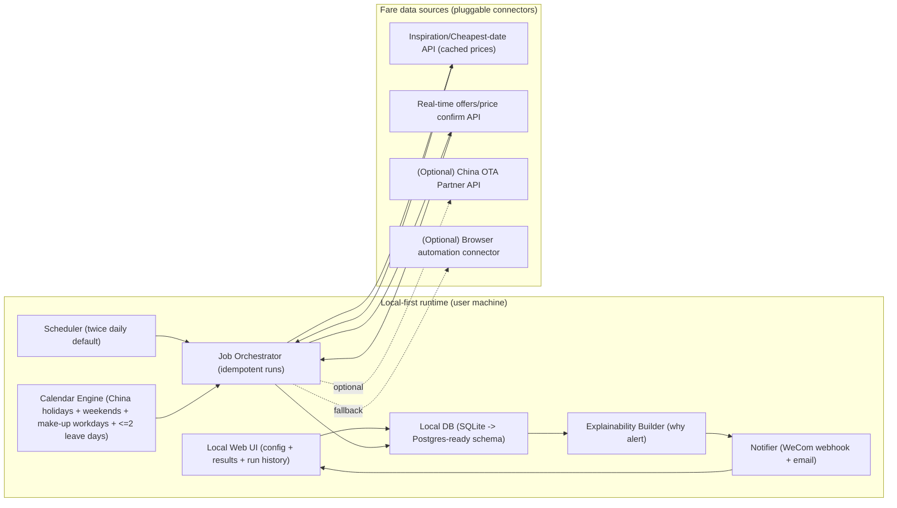
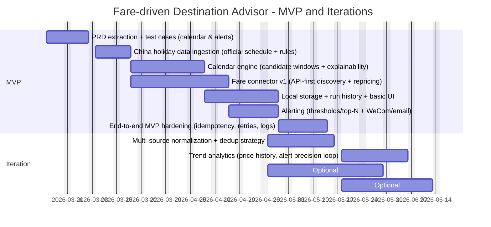

# Deep Research Report: Fare‑Driven Travel Destination Advisor

## Executive summary

The requirement described in your draft PRD is a **fare-first “where should I go?” assistant** that starts from **entity["city","Shanghai","China"]** airports, enumerates trip windows using the official China holiday/weekend system (including “调休/补班” complexity), collects fares for a rolling 1–3 month horizon, ranks opportunities by price, and pushes alerts (WeChat/email) without doing in-app booking. fileciteturn0file0

Across global and China consumer travel products, the closest analogs converge on three capability clusters:  
- **Destination discovery driven by price** (“Explore/Everywhere/Deals”),  
- **Flexible date / cheapest-date calendar**,  
- **Price tracking alerts** (email/push). citeturn0search0turn0search17turn0search2turn0search15turn1search15turn24view0  

However, none of the mainstream consumer products explicitly expose **China holiday-aware “拼假 + ≤2 workday extension” date generation** as a first-class decision engine, and none position as **local-first + compliance-aware multi-source collection** as a product constraint. This is the clear differentiation gap to exploit. citeturn4search1turn20view0

Implementation-wise, the best path for MVP under typical constraints (small team, limited budget, need for compliance) is an **API-first, local-first architecture** that uses:  
- Official holiday schedule + holiday regulation rules for calendar truth, citeturn4search1turn23search0  
- Flight “inspiration / cheapest-date” APIs with cached pricing for broad scanning, and on-demand real-time repricing only for candidates that pass thresholds, citeturn20view0turn19view1  
- WeCom (企业微信) group robot webhook for low-friction personal notifications, with email as a baseline channel. citeturn21view0  

Scraping/browser automation should be treated as a **last-resort gap filler**: it is operationally expensive and can trigger legal/contract disputes (a recurring industry issue, including high-profile litigation around unauthorized ticket reselling/scraping). citeturn22news47

## Unspecified items and decision options

Your current PRD draft makes the product direction clear, but several decision-critical parameters are unspecified. Below are the main ones and the “forks” they create.

**Target usage mode (single-user vs future public SaaS).**  
- If truly personal/local-first only, keep a single-tenant design (SQLite, local scheduler, minimal auth). fileciteturn0file0  
- If you want a clear path to public release, isolate data-source connectors behind an internal API and treat “tenancy” as a first-class dimension from day one (even if only one tenant initially). This reduces migration risk later (storage, quotas, secrets management).

**Coverage scope (domestic CN flights vs international; direct vs connecting; LCC coverage).**  
Some flight APIs have explicit coverage limitations (e.g., certain LCCs and major carriers may be unavailable in specific APIs). Planned destination sets (Japan/Korea/China cities/optional US West Coast) must be validated against whichever provider(s) you choose. fileciteturn0file0 citeturn20view0  

**Mobile app vs web UI, offline expectations.**  
- For personal MVP, a responsive web UI served locally is usually the highest ROI.  
- If mobile/offline is required later, choose a UI strategy like PWA or a thin native shell early, but only after the calendar+fare engine proves value.

**Notification channel choice in “WeChat ecosystem.”**  
- WeCom group robot webhook is fast to integrate and works well for alert-like messages; documentation and industry tooling typically treat it as an “ops alerting” lane. citeturn21view0turn5search4  
- Official Account/template messages introduce higher compliance and account/industry-category constraints; treat as later-phase if you go public.

**Budget/time/team skill level.**  
Because pricing and access differ drastically across airline/GDS/OTA partners, “budget” is not just compute—it is also **commercial access cost**. See solution options below for cost/risk profiles.

## Framework and method to extract key attributes from a PRD

This section provides a reusable PRD-to-architecture extraction framework, then maps it to the attributes explicitly referenced in your draft.

### Extraction checklist (what to pull, why it matters, what it drives)

| PRD attribute to extract | Why it is load-bearing | Drives key decisions |
|---|---|---|
| User roles & journeys (who configures, who receives alerts, who audits history) | Clarifies UI scope, state model, permissions | UI/UX, auth, data ownership |
| Core decision objective (primary ranking metric) | Determines data requirements and model simplicity | Ranking logic, storage schema |
| Candidate trip-window generation rules (weekends, holidays, “调休”, max extension days) | This is your differentiator; also the biggest logic trap in China calendars | Calendar engine, explainability, test cases |
| Fare search horizon and cadence (1–3 months; twice daily default) | Determines API usage volume and caching strategy | Scheduler, quotas, cost, rate limiting |
| Data sources and acquisition strategy (official APIs first; automation fallback) | Dominates compliance and ongoing maintenance cost | Connector abstraction; monitoring; legal review |
| Required explainability (“why this alert was sent”) | Converts a “deal feed” into a decision-support tool | Traceability: features stored per result |
| Non-functional requirements (local-first, reliability, scalable path) | Prevents architectural dead ends | Deployment model, observability, secrets |
| Integration points (WeChat/email; external booking deep links) | Determines identity/notification mechanics | Notification service, link tracking |
| Compliance & security constraints (scraping limits, data retention) | Protects against product shutdown | Source selection, storage encryption, audit logs |
| KPIs & success criteria (alert precision, time saved, click-through) | Forces measurement design | Event logging, AB testing hooks |

Your PRD already contains many of these elements (e.g., Shanghai origin airports PVG/SHA, 1–3 month rolling search, alerts, local-first, compliance-aware acquisition). fileciteturn0file0

### Calendar engine: what “must be explicit” in the PRD

For China, the calendar truth is not just weekends + statutory holidays; it includes **official “调休/补班” working days**. The 2026 official schedule explicitly lists holiday spans and adjusted working days (e.g.,春节 9 days off with two Saturdays as workdays; 国庆 7 days with a Sunday workday). citeturn4search1  
Additionally, the holiday regulation framework was amended (effective 2025-01-01), which is a strong signal: **calendar rules can change**, so you need annual schedule ingestion as a durable requirement, not a one-off dataset. citeturn23search0turn23search1

**PRD fields to add (recommended):**  
- Definition of “extension workdays” (must be adjacent? can they be split? can they include adjusted weekend workdays?)  
- Trip duration constraints (min/max nights) and whether “duration” can vary by destination category  
- Handling of multi-chunk travel windows (e.g., work 1 day in-between holidays is typically not acceptable for travel)

## Competitive landscape and requirement mapping

### Comparable products and solutions

The table below focuses on products that (a) inspire destinations by price, (b) track fare changes and alert, (c) expose date-flexibility tools, or (d) provide APIs/open platforms to build exactly this system.

> Pricing is included only where it is publicly specified; otherwise the model is described as “free consumer app,” “contact sales,” etc.

| Product / solution | Vendor | Primary users | Core capabilities relevant to this PRD | Differentiators (observed design intent) | Public price / pricing model | Authoritative sources |
|---|---|---|---|---|---|---|
| Google Flights (price tracking) | entity["company","Google","search company"] | Consumers | Track flight prices by route/dates and receive updates | “Track prices” as a first-class capability (route/date centric) | Free consumer service | citeturn0search0turn0search12 |
| Skyscanner (Price Alerts + Explore Everywhere) | entity["company","Skyscanner","travel search company"] | Consumers | Price Alerts; “Everywhere/Explore” discovery; choose dates or “Cheapest month” | Explicitly supports “destination-flexible” search sorted by price | Free consumer metasearch | citeturn0search1turn0search17turn0search9 |
| KAYAK (Explore + Price Alerts + forecast) | entity["company","KAYAK","travel metasearch company"] | Consumers | Price Alerts (daily + real-time option); Explore map; price forecasting guidance | Combines alerting with forecast-style “buy/wait” framing | Free consumer metasearch | citeturn0search2turn0search6turn22search8 |
| Hopper (app) | entity["company","Hopper","travel booking app company"] | Consumers | “Best time to buy” notifications; deals calendar | Strong emphasis on predictive guidance and calendar-based browsing | Free app; monetized via bookings/fintech add-ons | citeturn0search15turn22search2 |
| 携程旅行 (low-price assistant concept) | entity["company","Trip.com Group","online travel company"] | China consumers | “低价助手/订阅” for flights; travel booking & management | “Subscribe to low prices” aligns with “alert-first, book elsewhere” behavior | Free app; transaction/commission based | citeturn1search14turn1search3 |
| 去哪儿旅行 (low-price ticket alerts) | (same group as above) | China consumers | Low-price tickets; configurable low-price ticket alert notifications | “告别天天刷特价机票” framing; large supplier search coverage | Free app; transaction/commission based | citeturn1search15turn3search2 |
| 飞猪旅行 (low-fare reminder + AI assistant) | entity["company","Alibaba Group","internet company"] | China consumers | Low-fare reminders; broad travel booking; AI “问一问” travel assistant | Combines reminders with conversational “choose cost-effective flights/destinations” positioning | Free app; transaction/commission based | citeturn1search5turn3search21 |
| 航班管家 (fare monitoring + “low price map”) | entity["company","Shenzhen Huoli Tianhui Technology","flight travel app company"] | China consumers | “机票价格智能监控”; “自动捕捉90天历史低价”; low-price map; flight status alerts | Strong “monitoring system” framing; explicit historical-low capture | Free app | citeturn24view0 |
| Amadeus Self-Service flight APIs | entity["company","Amadeus","travel technology company"] | Developers | Inspiration search (destinations ordered by price); cheapest-date search; offers search; real-time repricing; cached vs real-time split | APIs explicitly designed for “discovery then confirm price/availability” workflows | Test+prod; monthly free quota; pay only above quota in production | citeturn13view0turn20view0turn2search0turn2search4 |
| Qunar Open Platform (business APIs) | (same group as above) | Developers/partners | Domestic & international flight standard APIs; “特惠(低价)/优选(服务)” product split (per platform description) | Clear partner integration story; China-centric supply | Contract/partner model (pricing not public) | citeturn3search2turn3search6 |
| Fliggy Open Platform (flight APIs) | (same group as above) | Developers/partners | Flight-related APIs; some marked “free API” but require authorization; business integration | Tight ecosystem integration; often aimed at merchants/agents | Contract/partner model; some APIs labeled “free” | citeturn3search14turn3search25turn3search21 |
| Duffel Flights API | entity["company","Duffel","flight booking api company"] | Developers | Flight shopping + ordering; fee model per confirmed order; excess search fee if search-to-book ratio too high | Modern “travel retailing API” with explicit fee breakdown | Public fee schedule (e.g., $3/order; $0.005 per excess search beyond ratio) | citeturn14view0turn2search6 |
| Travelport API Suite | entity["company","Travelport","travel technology company"] | Larger travel sellers | Multi-source content via API suite; “micro-services-based” platform with performance claims | A classic GDS-style route: scale, stability, enterprise process | Contractual; contact sales | citeturn2search3turn2search7 |

### Requirement mapping derived from competitors

To satisfy “each competitor’s requirement mapping,” the following are the **implied requirements** these products are built to meet (expressed in the same functional/non-functional language you’ll use in your PRD). This is the most actionable part for gap analysis.

- **Google Flights** is built for:  
  Functional: route/date price tracking; fare comparison and flexible-date browsing. citeturn0search0turn0search12  
  Non-functional: low friction (consumer free), high availability (implied by Google Travel productization). citeturn0search12  

- **Skyscanner** is built for:  
  Functional: destination-flexible search (“Everywhere/Explore”), cheapest-month browsing, and automated price-change notifications. citeturn0search17turn0search1  
  Non-functional: tracking without “re-search spiral,” and account-based saved lists/alerts. citeturn0search1  

- **KAYAK** is built for:  
  Functional: consolidated alerts management, daily refresh + optional real-time triggers, plus forecast-style “buy/wait” decision support. citeturn0search2  
  Non-functional: notification reliability at scale (structured alert scheduling described in help docs). citeturn0search2  

- **Hopper** is built for:  
  Functional: notify when it’s “best time to buy,” cheapest-date discovery via deals calendar. citeturn0search15  
  Non-functional: mobile-first engagement (App Store positioning) and push notification loops. citeturn0search15  

- **携程 / 去哪儿 / 飞猪 / 航班管家** (China consumer cluster) are built for:  
  Functional: low-price ticket discovery + reminders/alerts, and end-to-end travel transaction flow (except where explicitly “reminder-only”). citeturn1search14turn1search15turn1search5turn24view0  
  Non-functional: strong China supply coverage and operational cadence aligned with fast-changing fares (implied by “实时提醒/监控/订阅” product messaging). citeturn1search5turn24view0  

- **Amadeus Self-Service APIs** are built for:  
  Functional: a two-step discovery workflow—use cached “destinations ordered by price” or “cheapest dates” endpoints for scanning, then call real-time offers/pricing APIs to confirm availability and final price. citeturn20view0turn2search4  
  Non-functional: developer onboarding (test environment + free quotas), and production pay-as-you-go beyond free thresholds. citeturn13view0turn12search4  

- **Domestic OTA open platforms** (Qunar/Fliggy/Tongcheng-style) are built for:  
  Functional: partner distribution: standardized API access to flight content/operations (often with product tiers like “特惠/优选”). citeturn3search6turn3search21turn3search3  
  Non-functional: contractual/commercial gating (documentation and access often require partner onboarding). citeturn3search3turn3search6  

### Competitive gap matrix (what your product can win on)

Legend: ✓ supported well, ◐ partially supported, ✗ not a focus

| Product | Price-based destination discovery | Flexible dates / cheap calendar | Price alerts | China holiday “调休/拼假” engine | Explainability (“why alert”) | Local-first | Multi-source aggregation |
|---|---:|---:|---:|---:|---:|---:|---:|
| Google Flights | ◐ | ✓ | ✓ | ✗ | ◐ | ✗ | ◐ |
| Skyscanner | ✓ | ✓ | ✓ | ✗ | ◐ | ✗ | ✓ |
| KAYAK | ✓ | ✓ | ✓ | ✗ | ◐ | ✗ | ✓ |
| Hopper | ◐ | ✓ | ✓ | ✗ | ◐ | ✗ | ◐ |
| 携程 | ◐ | ◐ | ✓ | ✗ | ◐ | ✗ | ◐ |
| 去哪儿 | ◐ | ◐ | ✓ | ✗ | ◐ | ✗ | ✓ (claims broad search coverage) |
| 飞猪 | ◐ | ◐ | ✓ | ✗ | ◐ | ✗ | ◐ |
| 航班管家 | ◐ | ◐ | ✓ | ✗ | ◐ | ✗ | ◐ |

Support snapshots are grounded in the products’ published feature descriptions (alerts, explore, etc.) and do not assume hidden capabilities. citeturn0search0turn0search17turn0search2turn0search15turn1search15turn1search5turn24view0

## Implementation options and architecture patterns

Below are three distinct technical routes (plus one enterprise route) that can meet your PRD. The main selection axis is **data acquisition + compliance risk**, because everything else (UI, ranking, scheduling) is comparatively straightforward engineering.

### Option A: API-first, local-first single-tenant (recommended MVP)

**Core idea.** Use a flight API that explicitly supports *inspiration* and *cheapest-date* scanning with cached pricing, then only “confirm” real-time offers for candidates that cross thresholds. This directly matches your “rank low fares and alert” goal while controlling cost/quota. citeturn20view0turn19view1  

**Key components (practical stack suggestion).**  
- Backend: Python (FastAPI) + background scheduler (cron/APScheduler).  
- Storage: SQLite for MVP; schema designed to upgrade to Postgres.  
- Calendar engine: ingest annual official holiday notice + regulation constraints; build a “working_day/off_day” canonical table and derive candidate windows. citeturn4search1turn23search0  
- Fare collector: connector interface; first connector = Amadeus-like APIs:  
  - “Destinations ordered by price” for discovery, then  
  - “Cheapest dates” for date selection, then  
  - “Flight offers search + price confirmation” for real-time repricing. citeturn20view0turn2search0turn2search4  
- Ranking & alerting: deterministic rules first; log “why” features into the DB for explainability.  
- Notifications: WeCom group robot webhook + email. citeturn21view0  
- Observability: local log + structured run history UI.

**Scalability & HA posture.** Not required for MVP, but design the collector to be idempotent and resumable (per-date-window job keys). Your PRD explicitly wants a “scalable architecture path for future public deployment.” fileciteturn0file0

**Cost profile.**  
- Compute: near-zero if local.  
- API cost: depends on provider; Amadeus self-service uses test+production environments with monthly free quota and pay-as-you-go above quota in production. citeturn13view0turn12search4  

### Option B: China OTA partner/open-platform first (best China coverage, highest commercial friction)

**Core idea.** Integrate with domestic OTA open platforms (e.g., Qunar/Fliggy/Tongcheng-style) to maximize China route realism and price alignment with the apps your users actually book on.

**Key facts from public docs.**  
- Qunar open platform positions domestic flight APIs with product types such as “特惠(低价)” and “优选(服务)” and provides API-based access. citeturn3search6turn3search2  
- Fliggy open platform includes flight APIs; some endpoints are labeled “free API” but require authorization and platform constraints (e.g., inside specific environments). citeturn3search14turn3search25turn3search21  
- Tongcheng alliance explicitly indicates API documentation access is cooperation-gated (“联系BD”), which is a typical signal of non-self-serve integration. citeturn3search3turn3search15  

**Architecture pattern.** Similar to Option A, but the connector layer is dominated by partner auth, contract constraints, and data normalization across partner payloads.

**Main trade.** Better China coverage, but onboarding friction and long lead time can exceed MVP schedule.

### Option C: Controlled browser automation / agent fallback (gap-filler, not a foundation)

**Core idea.** Use headless browser automation (e.g., controlled Playwright-type flows) to fetch fares from selected sites where you have proper access, possibly requiring user login.

**Why it is risky.**  
- Continuous anti-bot and page churn cost.  
- Legal/terms risk is real: disputes over unauthorized reselling/scraping have triggered litigation and forced partnerization in the industry. citeturn22news47  

**When it’s justified.** Only as a secondary backstop when APIs cannot cover key routes, and only if you can do it in a compliance-aware way (rate limiting, honoring site constraints, user-consented sessions), consistent with your PRD risk section. fileciteturn0file0

### Option D: GDS/enterprise API route (future SaaS-grade, not MVP)

**Core idea.** Build on a GDS-style provider for breadth, stability, and enterprise workflows (shopping/booking/servicing). Travelport’s API suite markets microservices-based access and performance posture, but it is sales-gated. citeturn2search3turn2search7  

This is a “phase 2+” option once you validate the product loop and justify commercial access.

### Option comparison table

| Option | Best for | Data sources | Compliance risk | Build difficulty | Ongoing maintenance | Cost predictability |
|---|---|---|---|---|---|---|
| A: API-first local MVP | Fast validation, small team | Self-serve flight APIs with cached discovery + on-demand repricing citeturn20view0turn13view0 | Low–Medium (API T&Cs still apply) | Medium | Medium | Medium–High (pay-as-you-go above quotas) citeturn13view0 |
| B: China partner-first | Best China realism | Domestic OTA open platforms / affiliate APIs citeturn3search6turn3search21 | Low (if official partner) | High (commercial + technical) | Medium | Low (often contract-based) |
| C: Browser automation fallback | Quick coverage hack | Target websites via automation | High (terms + anti-bot) citeturn22news47 | Medium | High | Low (engineering time dominates) |
| D: GDS/enterprise | SaaS at scale | GDS/API suite | Low (contractual) | Very High | Medium | Low (sales-gated) citeturn2search3 |

## Recommended architecture and phased roadmap

### Strong recommendation

For your stated goals (personal-use first, local-first, compliance-aware, scalable path later), **Option A** is the best starting point. It aligns with how “Explore/Everywhere” consumer products work (scan cheaply, then confirm), but lets you add the missing China holiday “拼假” intelligence and full explainability ledger.

The product’s moat is **not the raw fare feed** (competitors already do alerts), but the **decision engine**: “Given China holiday constraints + my leave flexibility + destination preferences, what is the best value trip I can actually take?” The calendar engine and explanation trace are what you should overbuild early.

### Reference architecture diagram (Mermaid)

Design notes grounded in sources:  
- Use “cached scan then confirm real-time price” because the relevant flight APIs explicitly describe cached-price endpoints with links/workflows to real-time offers search. citeturn20view0turn2search4  
- Use WeCom group robot webhook for personal alerts because it is a documented, low-friction mechanism used widely for alerting-style notifications. citeturn21view0turn5search4  

### Implementation milestones (Mermaid Gantt)

Assuming a small team (1–3 engineers) starting the first work week after today (2026-02-23). Adjust durations based on team size and whether partner onboarding is needed.

### Concrete milestone deliverables (what “done” means)

**MVP exit criteria (product + engineering).**  
- Calendar engine reproduces 2026 official holiday spans and adjusted working days and can generate candidate trip windows with ≤2 extension workdays. citeturn4search1turn23search0  
- Fare scan runs on a schedule and produces a ranked list with stable run history and deduplicated “best option per destination/window.” fileciteturn0file0  
- Every alert contains an explanation record: window derivation, thresholds met, rank justification, and the source link to book externally (per your out-of-scope “no in-app booking”). fileciteturn0file0  
- WeCom webhook and email notifications function end-to-end (WeCom robot webhook retrieval/usage is operationally documented). citeturn21view0  

**Iteration priorities (high ROI).**  
- Expand connectors only after you have measured “alert precision” and “time saved.” Your PRD explicitly states these as investigation KPIs—build the instrumentation early so iteration is data-driven. fileciteturn0file0  
- Add trend view and “fare volatility warning,” because users often experience “price jumps / availability changes” between search and booking; revalidation and freshness labeling should be explicit (your PRD already flags volatility/trust). fileciteturn0file0